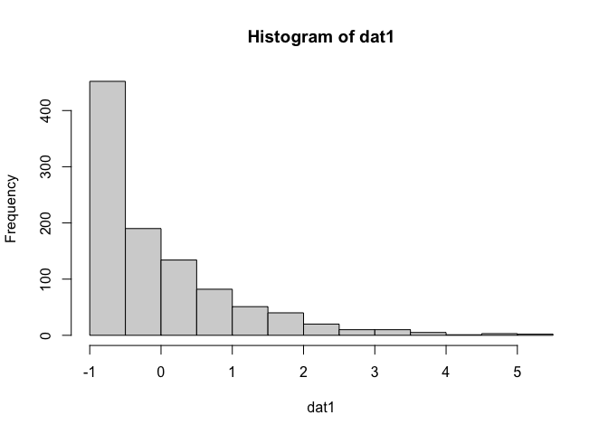
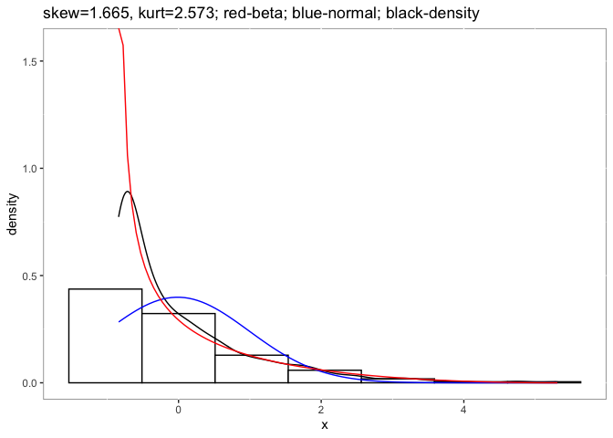
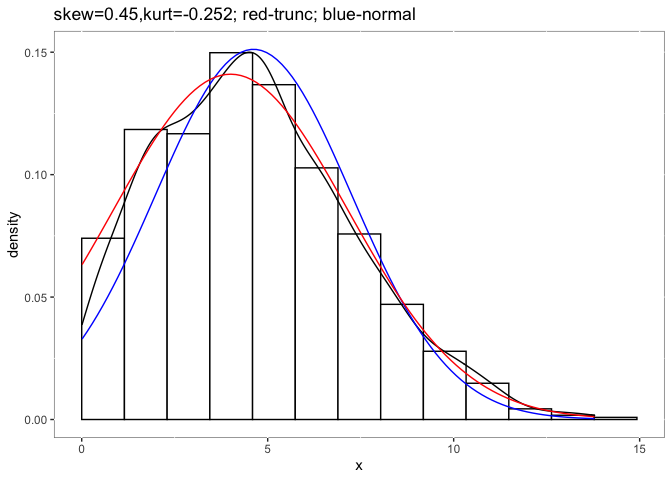

<!-- README.md is generated from README.Rmd. Please edit that file -->

# detectnorm: A Packcage for Detectng Non-normality

<!-- badges: start -->
<!-- badges: end -->

## Description

The goal of `detectnorm` is to speculate the skewness and kurtosis based
on the Beta and truncated normal distribution. When conducting a
meta-analysis for two independent groups, we generally retrieved very
limited statistics from primary studies, and it is hard to access the
raw data. However, the non-normality of raw data could influence the
meta-analytic results greatly (Sun & Cheung, 2020). This package allows
meta-analysis researchers to speculate the skewness and kurtosis of the
raw data, even without the raw data. Instead of normal distribution, if
the researcher believes the population distribution is non-normal, then
beta-distribution could be a good choice. If the researcher believes the
population distribution is normal but truncated by the measuring ability
of the instrument, then truncated normal distribution is a good option.
The package provides not only the skewness and kurtosis estimates but
also the figures to visualize them. Now, this package could work
directly with the standardized mean difference for two independent
groups. It also works for one group of data.

## Documentation

A good start to understand the problems of non-normality in primary
studies on meta-analytic results is the following paper:

Sun, R. W., & Cheung, S. F. (2020). The influence of nonnormality from
primary studies on the standardized mean difference in meta-analysis.
*Behavior Research Methods, 52*(4), 1552-1567.

## Installation

You can install the official version within R with:

``` r
install.packages("detectnorm")
```

You can also install the development version of `detectnorm` from
[GitHub](https://github.com/) with:

``` r
# install.packages("devtools")
devtools::install_github("irissun/detectnorm")
```

## Example

This is a basic example which shows you how to solve a common problem:

For one study if you assumed non-normal distribution in population:

``` r
library(detectnorm)
# Situations using beta distributions
set.seed(32411)
#Using Fleishman's method to generate non-normal data
dat1 <- rnonnorm(n = 1000, mean = 0, sd = 1, skew = 2, kurt = 5)$dat
hist(dat1)
```



``` r
psych::describe(dat1)
#>    vars    n  mean sd median trimmed  mad   min  max range skew kurtosis   se
#> X1    1 1000 -0.01  1  -0.38    -0.2 0.63 -0.84 5.31  6.15 1.88     4.16 0.03
#Suppose we don't know about the raw data
result <- desbeta(vmean = mean(dat1), vsd = sd(dat1),lo = min(dat1), hi = max(dat1), showFigure = TRUE, rawdata = dat1)
#> [1] "mean is -0.0125212643739019"
#> [1] "sd is 0.999848046282588"
#> [1] "min. is -0.839243624241584"
#> [1] "max. is 5.31239864959992"
result
#> $dat
#>       alpha     beta      mean        sd skewness kurtosis
#> 1 0.4574073 2.946161 0.1343905 0.1625335 1.665152 2.572622
#> 
#> $fig
```



For one study if you assumed normal distribution in population with
truncated by the measurements:

``` r
library(detectnorm)
#Truncated normal distribution
set.seed(34120)
dat2 <- truncnorm::rtruncnorm(n = 1000, a = 0, b = 14, mean = 4, sd = 3)
psych::describe(dat2)
#>    vars    n mean   sd median trimmed  mad  min   max range skew kurtosis   se
#> X1    1 1000 4.62 2.64   4.43    4.48 2.76 0.01 13.79 13.78 0.48    -0.13 0.08
destrunc(vmean=mean(dat2), vsd=sd(dat2), lo=0, hi=14, rawdata = dat2, showFigure = TRUE)
#> [1] "mean is 4.62042980360421"
#> [1] "sd is 2.63886011983622"
#> [1] "min. is 0"
#> [1] "max. is 14"
#> $dat
#>      pmean     psd      tm     tsd  skewness  kurtosis
#> 1 4.002982 3.15366 4.62043 2.63886 0.4499033 -0.252266
#> 
#> $fig
```



For one meta-analysis of two independent groups. It is very similar to
the requirements for package `metafor` only you need to add one or two
columns for each group about the possible minimum and maximum of the
data. It will add information including:

-   `alpha1`, `beta1`, `alpha2`, and `beta2` are the shape parameters of
    beta distributions;

-   `mean1`, `sd1.1`, `mean2`, `sd2.1` are the means and standard
    deviations of the standard beta distribution (ranged from 0 to 1);

-   `skewness1`, `kurtosis1`, `skewness2`, and `kurtosis2` are the
    skewness and kurtosis of the two groups.

``` r
library(detectnorm)
# examine the meta-analysis dataset by Bora et al (2009).
# Note: it is not exactly the same data as Bora et al (2009) meta-analyzed. 
# we also computed the cv (i.e., coefficient of variability) for the two groups (cv1 and cv2)
data(metadat)
head(metadat)
#>                   study n1    m1   sd1      cv1 n2    m2  sd2       cv2 p.max
#> 1 Corcoran et al., 1995 55 15.60 3.900 25.00000 30 18.30 1.60  8.743169    20
#> 2  Sarfati et al., 1997 24 18.40 6.700 36.41304 24 24.90 2.10  8.433735    28
#> 3 Sarfati et al., 1999a 25  9.90 3.690 37.27273 15 13.20 0.90  6.818182    14
#> 4 Sarfati et al., 1999b 26 18.65 6.446 34.56300 13 24.40 2.30  9.426230    28
#> 5  Russell et al., 2003  5 17.40 5.030 39.92063  7 23.86 3.84 62.337662    30
#> 6  Kington et al., 2000 16  7.75 1.240 16.00000 16  9.06 0.85  9.381898    10
#>            d
#> 1 -0.8219599
#> 2 -1.3091967
#> 3 -1.1062829
#> 4 -1.0534843
#> 5  1.4786940
#> 6 -1.2323171
metadat2 <- detectnorm(m1i = m1,sd1i = sd1,n1i = n1, hi1i = p.max,lo1i = 0,m2i = m2,sd2i = sd2,n2i = n2, hi2i = p.max,lo2i=0,distri = "beta", data = metadat)
head(metadat2)
#>                   study n1    m1   sd1      cv1 n2    m2  sd2       cv2 p.max
#> 1 Corcoran et al., 1995 55 15.60 3.900 25.00000 30 18.30 1.60  8.743169    20
#> 2  Sarfati et al., 1997 24 18.40 6.700 36.41304 24 24.90 2.10  8.433735    28
#> 3 Sarfati et al., 1999a 25  9.90 3.690 37.27273 15 13.20 0.90  6.818182    14
#> 4 Sarfati et al., 1999b 26 18.65 6.446 34.56300 13 24.40 2.30  9.426230    28
#> 5  Russell et al., 2003  5 17.40 5.030 39.92063  7 23.86 3.84 62.337662    30
#> 6  Kington et al., 2000 16  7.75 1.240 16.00000 16  9.06 0.85  9.381898    10
#>            d    alpha1    beta1     mean1     sd1.1 skewness1  kurtosis1
#> 1 -0.8219599 0.7728205 2.740000 0.2200000 0.1950000 1.0418605  0.4569493
#> 2 -1.3091967 1.0062693 1.928683 0.3428571 0.2392857 0.5322981 -0.6575599
#> 3 -1.1062829 0.5801587 1.400871 0.2928571 0.2635714 0.7896528 -0.4570207
#> 4 -1.0534843 1.0674757 2.129243 0.3339286 0.2302143 0.5552562 -0.5804207
#> 5  1.4786940 3.2194278 4.445877 0.4200000 0.1676667 0.1974639 -0.5095678
#> 6 -1.2323171 2.3266633 8.014062 0.2250000 0.1240000 0.7188368  0.2672394
#>      alpha2     beta2      mean2      sd2.1 skewness2 kurtosis2
#> 1 0.9479492 10.204395 0.08500000 0.08000000 1.5776656 3.0457740
#> 2 1.8271623 14.676239 0.11071429 0.07500000 1.1220588 1.4840549
#> 3 0.6878307 11.349206 0.05714286 0.06428571 1.9630607 4.9969845
#> 4 2.0063462 13.598569 0.12857143 0.08214286 1.0273811 1.1756730
#> 5 1.8287364  7.106458 0.20466667 0.12800000 0.8439874 0.4762345
#> 6 1.0140161  9.773389 0.09400000 0.08500000 1.4941173 2.6705274
```
