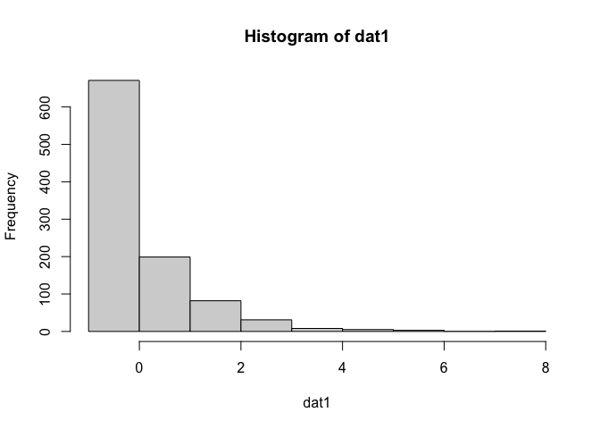
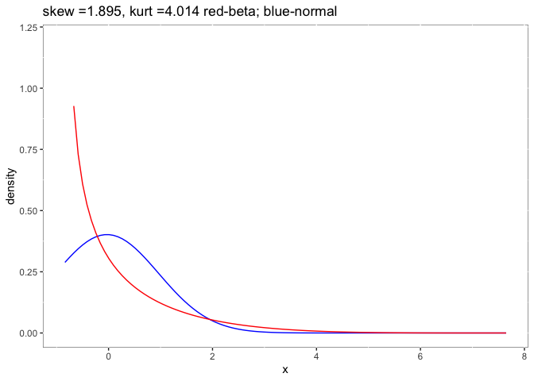
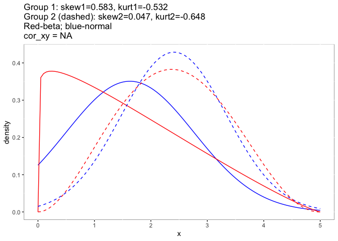
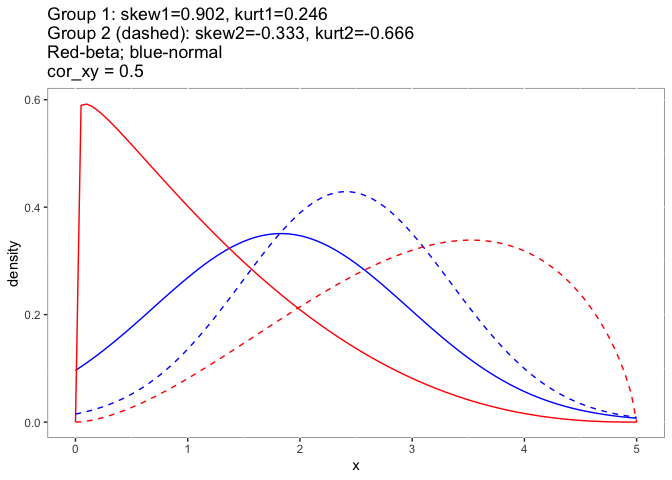

<!-- README.md is generated from README.Rmd. Please edit that file -->

# detectnorm

<!-- badges: start -->
<!-- badges: end -->

The goal of detectnorm is to provide an eduacated guess on nonnormality
without raw data based on the Beta distribution. When conducting a
meta-analysis for two independent groups, we generally retrieved very
limited statistics from primary studies, and it is hard to access the
raw data. However, the non-normality of raw data could influence the
meta-analytic results greatly (Sun & Cheung, 2020). his package allows
meta-analysis researchers to speculate the skewness and kurtosis of the
raw data, even without the raw data.

The package provides not only the skewness and kurtosis estimates but
also the figures to visualize them. Now, this package could work
directly with the standardized mean difference for two independent and
dependent groups. It also works for one group of data.

It makes it easier to have a quick check for meta-analysis with only
means, standard deviations, and possible ranges (not sample minimum and
sample maximum). We also provide a check for the tails directions of the
two groups for meta-analysis. When the two tails are pointing towards
each other (check_tail: “toward”), together with the skewnesses \> 1.0
or \< -1.0, researchers should be carefully use the normal way for
meta-analytic analyses.

## Documentation

A good start to understand the problems of non-normality in primary
studies on meta-analytic results is the following paper:

Sun, R. W., & Cheung, S. F. (2020). The influence of nonnormality from
primary studies on the standardized mean difference in meta-analysis.
*Behavior Research Methods*, 52(4), 1552-1567.

## Installation

You can install the official version within R with (not the most updated
version):

``` r
install.packages("detectnorm")
```

You can install the development version of detectnorm from
[GitHub](https://github.com/) with:

``` r
# install.packages("devtools")
devtools::install_github("irissun/detectnorm")
```

## Example

This is a basic example which shows you how to solve a common problem:

For one study if you assumed non-normal distribution in population:

``` r
devtools::load_all()
#> ℹ Loading detectnorm
```

``` r
#library(detectnorm)
#nonnormal 
set.seed(65180)
#Using Fleishman's method to generate non-normal data
dat1 <- rnonnorm(n = 1000, mean = 0, sd = 1, skew = 2, kurt = 5)$dat
psych::describe(dat1)
#>    vars    n  mean   sd median trimmed  mad   min  max range skew kurtosis   se
#> X1    1 1000 -0.03 0.99  -0.39   -0.22 0.58 -0.84 7.65  8.49 2.23     7.39 0.03
```

``` r
hist(dat1)
```



Suppose we don’t have the raw data. We could only get the means,
standard deviations, ranges from one paper.

``` r
ex1 <- desbeta(vmean = mean(dat1), vsd = sd(dat1), lo = min(dat1), 
               hi = max(dat1), showFigure = TRUE)
```



``` r
ex1
#>        bmean       bsd    balpha    bbeta    bskew    bkurt
#> 1 0.09530485 0.1169151 0.5058567 4.801918 1.894664 4.014271
```

The skewness `ex1$bskew` and kurtosis `ex1$bkurt` estimated from beta
distribution are 1.895 and 4.014. The values are very close to 2 that
set at the beginning.

The function `des2beta` works well for independent two groups and
dependent two groups with figure to give direct impression on the
nonnormal problems.

``` r
#independent two groups
des2beta(vmean=c(1.63, 2.41), vsd=c(1.137, .930),hi = c(5, 5), lo = c(0, 0), design = "ind", showFigure = TRUE)
```



    #> [[1]]
    #>   g1bmean  g1bsd  g1alpha   g1beta    g1skew     g1kurt g2bmean g2bsd  g2alpha
    #> 1   0.326 0.2274 1.059205 2.189891 0.5830882 -0.5317609   0.482 0.186 2.996548
    #>     g2beta     g2skew   g2kurt
    #> 1 3.220356 0.04710981 -0.64801
    #> 
    #> [[2]]


``` r
#dependent two groups
des2beta(vmean=c(1.83, 2.41), vsd=c(1.137, .930),hi = c(5, 5), lo = c(0, 0), design = "dep", cor_xy = .5, showFigure = TRUE)
```



    #> [[1]]
    #>    alpha11    alpha10  alpha01  alpha00   g1bmean     g1bsd  g1alpha   g1beta
    #> 1 1.140538 -0.1001489 1.556101 1.810383 0.2360833 0.1826344 1.040389 3.366484
    #>      g1skew    g1kurt   g2bmean     g2bsd  g2alpha   g2beta     g2skew
    #> 1 0.9021902 0.2460261 0.6119167 0.2095731 2.696639 1.710234 -0.3334057
    #>       g2kurt
    #> 1 -0.6658308
    #> 
    #> [[2]]


For one meta-analysis, which may have studies that contain dependent two
groups and independent two groups, the function works well for the
dataset used for package `metafor`. You need to add columns for `hi1`
(i.e., maximum value for group 1), `hi2` (i.e., maximum value for group
2), `lo1` (i.e., minimum value for group 1), `lo2` (i.e., minimum value
for group 2), `design` (i.e., research design: either “dep” or “ind”),
and `cor_xy` (i.e., correlations for dependent two groups, `NA` for
independent two groups).
